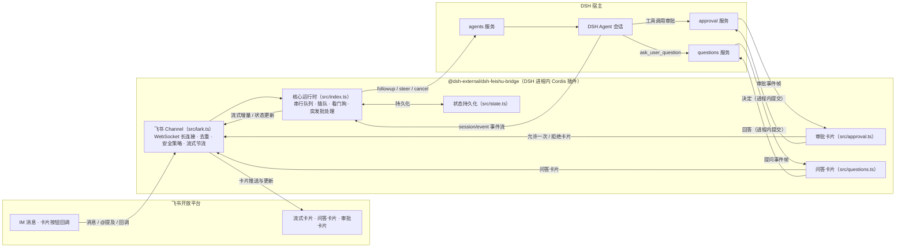

# @dsh-external/dsh-feishu-bridge

> 飞书机器人 ↔ DSH 对话桥：把 DeepSeek Harness（DSH）装进飞书，聊天即算力。


-4B32C3)


DSH（DeepSeek Harness）的进程内 Cordis 插件：飞书 IM 收发消息，流式卡片实时呈现 DSH 的思考与工具调用进度；问答卡片、工具审批卡片直接在飞书里点按完成；斜杠命令全量遥控会话——无需打开 Web GUI，也能完整使用 DSH。

## ✨ 功能特性

- 🚀 **飞书 IM ↔ DSH 对话桥**：基于 WebSocket 长连接收发消息，私聊即聊即答，群聊 @ 机器人触发。
- 📬 **出站 Outbox 零丢失**：非流式回复与兜底错误通知先进持久化队列再投递（JSONL 分段 + 原子落盘、幂等键防重复），失败按有界指数退避重试，进程崩溃 / 重启后自动续投，at-least-once 不丢消息。
- 📥 **入站 WAL 请求补发**：消息注入 Agent 前先落盘，回复确认送达后记账；进程崩溃 / 重启后启动对账，自动重新触发未送达的纯文本消息（单条最多补发 2 次、30 分钟窗口内），不再静默丢请求。
- ⚡ **流式卡片**：DSH 输出逐字实时渲染到飞书卡片，思考过程「看得见」。
- 📑 **Markdown 结构化卡片**：非流式回复自动识别 Markdown 结构（标题 / 列表 / 代码块 / 表格 / 分隔线 / 引用）渲染为结构化飞书卡片；超长（60 行 / 4000 字符）或解析异常自动降级为纯文本卡片；流式卡片保持逐字渲染不变。
- 🔧 **工具调用进度**：agent 调用工具时卡片实时显示「🔧 正在调用工具：xxx…」，多步回合不再干等。
- 🎯 **问答卡片**：agent 的 `ask_user_question` 以交互卡片呈现——按钮单选、勾选多选、聊天自由文本作答，点按即答。
- 🛡️ **工具审批卡片**：agent 请求工具时推送「✅ 允许一次 / 🚫 拒绝」卡片，决策在飞书内完成；10 分钟未响应自动过期撤卡。
- 😀 **表情回执**：收到消息随机打一个「已收到」表情，回合完成打 DONE ✅；仅使用飞书实测有效的表情全集（防 400 报错）；扫码一键配置自动申请 `im:message.reaction` 权限（旧应用需手动补开）。
- ⚡ **扫码一键配置**：装好插件后发 `/setup`（飞书内）或调用 `feishu_setup` 工具（DSH 内），扫码即自动完成「创建应用 + 获取凭据 + 重连飞书」，免去手动开放平台配置。
- 🧠 **思考强度调节**：`/effort` 查看当前模型支持的思考档位，`/effort <档位>` 切换，下一回合生效、偏好持久化。
- ⌨️ **斜杠命令**：17 个命令覆盖模型切换、思考强度、工作区管理、会话恢复、流式开关、免审批模式、扫码配置等（见下方命令表）。
- 🚦 **命令三级分流**：桥特有命令 → DSH 宿主注册命令（如 `/goal`，原生执行不走模型）→ 未知 `/xxx` 与普通消息原样注入 Agent，三级自动分流，命令与对话互不误伤。
- 🔀 **每会话串行队列 + 插队**：同一聊天内消息按序处理；新消息可打断运行中的慢回合（阈值可配），也可强制排队。
- 🐕 **看门狗**：单回合超过时限自动取消该回合并回复错误卡片，**绝不退出进程**。
- 📦 **消息突发批处理**：短窗口内连发的普通消息合并为一次进入 DSH，省调用、省 token。
- 🚧 **入站防护**：单条消息长度上限（默认 20000 字符，超出截断并提示）+ 每 chat 每分钟消息数上限（默认 30 条，防刷屏烧 LLM 额度），config 可调、`0` = 关闭。
- 💾 **状态持久化**：会话代次、工作区绑定等持久化到本地状态文件，重启后记忆保留。
- 🩹 **可靠性加固**：state.json 原子落盘（tmp + rename + 0600，防写半截丢状态）；问答卡片断流 2 秒退避自动重订阅（防断线后静默失效）。
- 🔁 **断线自愈**：长连接异常自动退避重连；重连后向所有已知会话广播恢复通知。
- ⛔ **连接配额熔断**：60 分钟窗口内连接失败达阈值（默认 12 次）自动熔断停止重试，防飞书连接配额烧穿；窗口过期自动恢复，失败历史落盘跨重启生效；`/restart` 手动重连即解除熔断。
- 🧠 **会话记忆管理**：`/reset` `/new` 开启新的记忆代次，`/resume` 带摘要恢复历史会话，`/workspace` 绑定工作区。
- 📊 **用量透明**：回复卡片底部显示本会话累计 token 用量（输入 / 输出，K/M 格式化）。

## 📐 架构

本插件是运行在 DSH 进程内的 Cordis 插件（`inject: ['agents']`），通过 **ctx 服务直调**驱动 DSH：

- 消息注入走 `agents` 服务的 `create` / `resume` / `followup` / `steer` / `cancel`，全程进程内直调，不另起进程、不走网络；
- 审批卡片与问答卡片订阅宿主的进程内事件帧，经 `approval` / `questions` 服务交互，点按结果直接提交回宿主；
- 不注册任何 provider / answerer，不与宿主自带实现冲突，卸载即净。



模块一览：

| 模块 | 职责 |
| --- | --- |
| `src/index.ts` | 插件入口与核心运行时：消息入口、每 chat 串行队列与插队、看门狗、流式 / 非流式回复管线、Outbox / WAL / 配额熔断 / 表情回执接线、生命周期 |
| `src/lark.ts` | 飞书 Channel：WebSocket 长连接、消息去重、聊天队列、陈旧消息窗口、流式卡片节流 |
| `src/commands.ts` | 斜杠命令表与三级分流：Tier 1 桥命令 / Tier 2 宿主注册命令原生执行 / Tier 3 注入 Agent |
| `src/outbox.ts` | 出站 Outbox：JSONL 分段 + 原子落盘、幂等键防重复投递、分航道 FIFO、有界指数退避、终态自清理、超长 payload 溢出 blobs/ |
| `src/wal.ts` | 入站 WAL：注入前落盘、delivered 记账、启动对账补发（2 次 / 30 分钟窗口上限） |
| `src/reactions.ts` | 表情回执：飞书实测 emoji 白名单过滤、随机「已收到」池、DONE 完成标记 |
| `src/markdown-card.ts` | Markdown 结构化渲染：标题 / 列表 / 代码块 / 表格 → CardKit 元素，超限或异常降级为纯文本 |
| `src/quota.ts` | 连接配额熔断：60 分钟窗口失败计数、跨重启落盘（0600）、熔断状态查询 |
| `src/approval.ts` | 工具审批卡片：订阅审批事件、发卡、按钮回调路由、过期回收、YOLO 自动放行 |
| `src/questions.ts` | 问答卡片：单选 / 多选 / 自由文本、答案提交、过期回收、断流自动重订阅 |
| `src/batching.ts` | 消息突发批处理：滑动窗口合并普通消息 |
| `src/state.ts` | 状态持久化：会话代次 / 会话列表 / 工作区绑定 / 会话覆盖（原子落盘 0600） |
| `src/text.ts` | 文本处理：@ 提及剥离、超长截断、token 数量格式化 |

## 🚀 快速开始

从零到用上大约 10 分钟：把插件装进 DSH（方式 A / B / C 任选），扫码一键配置（或手动）拿到应用与凭据，最后在飞书里与机器人对话。

### 前提

- 已部署 **DSH（DeepSeek Harness）** 环境。
- 本插件 `peerDependencies` 依赖 DSH 内部包（`@deepseek-ai/dsh-llm`、`@deepseek-ai/dsh-tools`，不发布于公开 npm）以及 `cordis`、`schemastery`，**必须运行在 DSH 进程内**，无法独立安装或独立部署。
- 一个可登录[飞书开放平台](https://open.feishu.cn/)的账号。

### 第一步：获取飞书应用

本插件使用**长连接模式**与飞书通信：插件主动发起 WebSocket 连接收发消息，**不需要公网回调地址，也不需要配置任何 webhook**。飞书应用有两种获取方式，推荐扫码一键配置。

#### ✅ 首选：扫码一键配置

装好插件后（方式 A / B / C 任一），无需手动去开放平台创建应用。**首次配置（插件还没连上飞书）只能走 DSH 入口**——此时机器人无法收发消息，飞书里的 `/setup` 发不出去；DSH 入口不依赖飞书连接，是唯一的从零路径：

1. **发起配置**（二选一）：
   - **DSH 内（首次配置必选）**：在 DSH 的会话里对 agent 说「**配置飞书**」或「**生成飞书授权链接**」，agent 会自动调用 `feishu_setup` 工具，**返回一个授权链接**（含过期时间，如 3600 秒）。把链接复制到浏览器打开，或用飞书扫码，授权完成后工具自动写入凭据并重连，直接在会话里看到结果——全程无需离开 DSH；
   - 飞书内：给机器人发 `/setup`（需已有凭据连接、桥正常运行），返回同样的授权链接。适合已连接后**换应用 / 刷新凭据**。
2. 打开链接，用飞书 App 扫码确认。应用名预填为「{user} 的 DSH 飞书桥」，权限预填 `im:message` / `im:message:send_as_bot`、消息事件与卡片回调。
3. 授权完成后插件自动获取 App ID / Secret，写入 `~/.dsh/dsh-feishu-bridge/credentials.json`（权限 0600），并自动重连飞书（等价热重载：内存态偏好重置，持久化状态保留），无需重启 DSH。

> ⚠️ 平台灰度可能忽略预填的权限：若扫码授权成功但机器人不回复，按下方排错表到开发者后台补开权限并重新发布版本。
> ⚠️ 每次 `/setup` / `feishu_setup` 都会**创建新应用**（createOnly 设计），重复执行会累积多个应用；介意可在开发者后台删除旧应用。

#### 进阶：手动创建飞书应用（可选）

不想扫码时，也可以手动把应用信息准备好：

1. 打开[飞书开放平台](https://open.feishu.cn/) → 进入「开发者后台」→ 点击**创建企业自建应用**，填写名称与描述后创建。
2. 在应用详情页的「添加应用能力」中启用**机器人**。
3. 在「权限管理」中搜索并开通以下两个权限：
   - `im:message` —— 读取用户发给机器人的消息（含群聊 @ 消息）；
   - `im:message:send_as_bot` —— 以机器人身份发送消息。
4. 在「可用范围」中添加需要使用机器人的成员与群组（默认可能为空，不加则任何人都用不了）。
5. 在「版本管理与发布」中**创建版本并发布**，等待审核通过后应用才真正生效。⚠️ 大量「机器人不回复」的案例都是只保存了配置、忘了发布版本。
6. 在「凭证与基础信息」中记下 **App ID**（形如 `cli_xxxxxxxx`）与 **App Secret**，第三步会用到。

### 第二步：安装插件（三种方式任选其一）

方式 A：标准装配（无注入器）；方式 B：注入器一键安装（已有 dsh-super-injector）；方式 C：命令行一键安装（推荐给熟悉命令行的用户）。三种方式任选其一即可。

#### 方式 C：命令行一键安装（推荐给熟悉命令行的用户）

> 支持 Linux / macOS（bash）。Windows 用户请使用下方「只下载不安装」命令拿到 tgz 后，按方式 A 手动安装。

一条命令自动完成「下载最新 Release → 解压到 `~/dsh-plugins/dsh-feishu-bridge` → 装配进 `web` profile → 建软链」：

```bash
curl -fsSL https://raw.githubusercontent.com/21hbguo/dsh-feishu-bridge-plugin/main/scripts/install.sh | bash
```

或分步执行（建议先下载查看脚本内容再运行）：

```bash
curl -fsSL -o install.sh https://raw.githubusercontent.com/21hbguo/dsh-feishu-bridge-plugin/main/scripts/install.sh
bash install.sh
```

默认装配到 `web` profile；可用参数自定义，例如：

```bash
bash install.sh --profile my-profile --dir ~/dsh-plugins/dsh-feishu-bridge
bash install.sh --help    # 查看全部参数与示例
```

只下载不安装（把最新 tgz 下载到当前目录；资产名以 Release 页为准）：

```bash
curl -fsSL -O https://github.com/21hbguo/dsh-feishu-bridge-plugin/releases/latest/download/dsh-external-dsh-feishu-bridge-0.0.2.tgz
```

脚本自动完成下载 / 解压 / 装配 / 建软链，完成后**完全重启 DSH** 即生效；想手动控制每一步，参考方式 A。

#### 方式 A：标准装配（无注入器，推荐）

不需要任何注入器或开发工具，手动装配 4 步：

1. **下载并解压**：在 [GitHub Releases](https://github.com/21hbguo/dsh-feishu-bridge-plugin/releases) 下载最新 `.tgz` 包（如 `dsh-external-dsh-feishu-bridge-0.0.2.tgz`，资产名以 Release 页为准），解压到固定目录（示例 `~/dsh-plugins/dsh-feishu-bridge`）：

   ```bash
   mkdir -p ~/dsh-plugins/dsh-feishu-bridge
   tar -xzf dsh-external-dsh-feishu-bridge-0.0.2.tgz -C ~/dsh-plugins/dsh-feishu-bridge --strip-components=1
   ```

2. **编辑 profile 配置**：打开 `~/.dsh/profiles/<profile>/package.json`（`<profile>` 为你的 profile 名，如 `web`），把插件加入依赖与装配清单：

   ```json
   {
     "name": "dsh-profile-web",
     "dependencies": {
       "@dsh-external/dsh-feishu-bridge": "link:/home/xxx/dsh-plugins/dsh-feishu-bridge"
     },
     "dsh": {
       "profile": {
         "bundles": ["@deepseek-ai/dsh-base", "@dsh-external/dsh-feishu-bridge"]
       }
     }
   }
   ```

   把 `link:` 后面的路径替换为第 1 步的解压目录。

3. **建立 node_modules 软链**：在 profile 的 `node_modules/@dsh-external/` 下创建指向解压目录的链接（目录不存在先创建）：

   ```bash
   # Linux / macOS
   mkdir -p ~/.dsh/profiles/<profile>/node_modules/@dsh-external
   ln -s ~/dsh-plugins/dsh-feishu-bridge ~/.dsh/profiles/<profile>/node_modules/@dsh-external/dsh-feishu-bridge
   ```

   ```powershell
   # Windows（PowerShell）
   New-Item -ItemType Directory -Force "$env:USERPROFILE\.dsh\profiles\<profile>\node_modules\@dsh-external"
   New-Item -ItemType Junction -Path "$env:USERPROFILE\.dsh\profiles\<profile>\node_modules\@dsh-external\dsh-feishu-bridge" -Target "$env:USERPROFILE\dsh-plugins\dsh-feishu-bridge"
   ```

   ```cmd
   # Windows（cmd，管理员权限）
   mkdir "%USERPROFILE%\.dsh\profiles\<profile>\node_modules\@dsh-external"
   mklink /D "%USERPROFILE%\.dsh\profiles\<profile>\node_modules\@dsh-external\dsh-feishu-bridge" "%USERPROFILE%\dsh-plugins\dsh-feishu-bridge"
   ```

4. **重启 DSH**：完全退出并重新启动 DSH（不是刷新页面），插件随 profile 装配自动加载。

> 已安装 `dsh-super-injector` 注入器的用户请直接用方式 B，一行命令完成装配与软链，无需手动编辑。

#### 方式 B：注入器一键安装（已有 dsh-super-injector）

1. 在 [GitHub Releases](https://github.com/21hbguo/dsh-feishu-bridge-plugin/releases) 下载最新 `.tgz` 包，解压得到包目录（方法同方式 A 第 1 步）。
2. 在 DSH 管理端对**包目录**使用注入器：
   - `dev_install_package <包目录>` —— 热装配并写入装配清单，重启后依然生效（推荐）；
   - `dev_inject_plugin <包目录>` —— 运行时注入，免重启（重启后失效）。

> 可选：从源码构建（进阶）。`git clone https://github.com/21hbguo/dsh-feishu-bridge-plugin` 后，需在 DSH checkout 环境下执行 `DSH_CHECKOUT=<dsh-checkout-路径> bash scripts/build.sh`（产物为 `lib/`），随后按方式 A 或方式 B 安装。构建依赖 DSH 内部包，**脱离 DSH checkout 无法独立构建**，绝大多数用户无需走这条路。

### 第三步：配置凭据（二选一）

两种方式二选一：**一键扫码（推荐）** 见第一步——扫码完成后插件自动把凭据写入 `~/.dsh/dsh-feishu-bridge/credentials.json`（权限 0600），无需手动配置；或手动用环境变量 / 插件 Config 配置：

**方式 1：环境变量** —— 在启动 DSH 的终端（或启动脚本）中导出：

```bash
export FEISHU_APP_ID="cli_xxxxxxxxxxxxxxxx"
export FEISHU_APP_SECRET="xxxxxxxxxxxxxxxx"
```

**方式 2：插件 Config** —— 在 DSH 插件配置中填写：

| 字段 | 说明 |
| --- | --- |
| `feishuAppId` | 飞书应用 App ID（未填时回退 `FEISHU_APP_ID`，再回退扫码凭据文件） |
| `feishuAppSecret` | 飞书应用 App Secret（未填时回退 `FEISHU_APP_SECRET`，再回退扫码凭据文件） |

凭据优先级：**Config > 环境变量 > 扫码凭据文件**；三种来源都缺失时插件启动才报缺凭据错误。

### 第四步：验证

1. 在飞书里搜索机器人（应用名称），**私聊**发送一条消息，如 `你好`。
2. 机器人应回复**流式卡片**：DSH 的思考与工具调用进度逐字实时渲染，回复底部显示本会话 token 用量，即链路正常。
3. 在**群聊**里测试：必须 **@机器人** 才会触发回复（私聊无需 @）。

### 常见问题排错表

| 现象 | 原因 | 解决 |
| --- | --- | --- |
| 机器人完全不回复 | 应用未**发布版本**（只保存了配置） | 开放平台 → 版本管理与发布 → 创建版本并发布，等待审核通过 |
| 机器人完全不回复 | 当前用户/群不在应用**可用范围**内 | 开放平台 → 可用范围 → 添加测试成员与群组 |
| 报错 403 / 权限不足 | 未开通 `im:message` / `im:message:send_as_bot` | 「权限管理」开通后需**重新创建版本并发布**再试 |
| 群聊不回复 | 消息没有 @ 机器人 | 群聊必须 @ 机器人才会进入处理，私聊无需 @ |
| 启动报缺凭据 | App ID / App Secret 未配置或填错 | 核对环境变量 / Config 与开放平台「凭证与基础信息」是否一致 |
| 插件未生效（无日志、无机器人） | profile 装配 / 软链 / 重启未完成 | 核对 `dependencies` 与 `bundles` 是否包含插件、`node_modules` 软链是否指向解压目录、是否完全重启 DSH |
| 回复不是逐字刷新 | 流式开关被关闭 | 私聊发送 `/stream on` 开启流式回复 |
| 扫码授权成功但机器人不回复 | 平台灰度未预填权限 | 到开发者后台补开机器人能力与 `im:message` / `im:message:send_as_bot` 权限，并**重新创建版本并发布** |
| `/setup` 多次执行累积多个应用 | 属预期行为：每次扫码都创建新应用（createOnly 设计） | 介意可在开发者后台删除旧应用 |

## ⚙️ 配置项

| 字段 | 类型 | 默认值 | 说明 |
| --- | --- | --- | --- |
| `feishuAppId` | string | `''`（回退 `FEISHU_APP_ID`） | 飞书应用 ID（未填时回退 `FEISHU_APP_ID`，再回退扫码凭据文件） |
| `feishuAppSecret` | string | `''`（回退 `FEISHU_APP_SECRET`） | 飞书应用密钥（未填时回退 `FEISHU_APP_SECRET`，再回退扫码凭据文件） |
| `stream` | boolean | `true` | 流式卡片总开关（每个会话可用 `/stream` 覆盖） |
| `maxTurnMs` | number | `600000` | 看门狗时长：单回合超过该毫秒数则取消该回合，并回复错误卡片 |
| `interruptAfterMs` | number | `0` | 插队阈值：运行中回合超过该毫秒数，新消息打断它优先处理（`0` = 立即打断） |
| `streamThrottleMs` | number | `40` | 流式卡片推送节流间隔（毫秒） |
| `streamThrottleChars` | number | `12` | 流式卡片推送触发字符数 |
| `maxReplyChars` | number | `4000` | 非流式回复截断阈值（字符） |
| `batchWindowMs` | number | `800` | 消息突发批处理窗口（毫秒）：窗口内同一聊天的连续普通消息合并为一条进入 DSH；`0` = 禁用 |
| `maxMessageChars` | number | `20000` | 入站单条消息长度上限（字符）：超出截断并提示；`0` = 不限制 |
| `rateLimitPerMinute` | number | `30` | 入站限流：每 chat 每分钟消息数上限（agent 注入前防护，防刷屏烧额度）；`0` = 不限制 |

## ⌨️ 斜杠命令

| 命令 | 参数 | 说明 |
| --- | --- | --- |
| `/help` | — | 列出所有可用命令 |
| `/ping` | — | 连通性自检（回复 `pong 🏓`） |
| `/status` | — | 查看桥与当前会话状态：机器人、模型、会话 ID、工作区、流式开关、队列深度、运行时长、最近回答摘要、连接配额熔断状态（`⛔ 已熔断` / `🔌 剩余 N 次`） |
| `/reset` | — | 清空本会话记忆，开启新的 DSH 会话 |
| `/new` | — | 同 `/reset`，开启新会话 |
| `/workspace` | `[序号 \| 路径]` | 列出 / 切换工作区；`/workspace 0` 解除绑定（未分组，宿主默认 cwd）；`<路径>` 为已存在目录时自动创建并绑定；切换即开新会话（记忆清空） |
| `/model` | `[序号]` | 列出可用模型，或 `/model <序号>` 切换（下一回合生效，记忆保留） |
| `/effort` | `[档位]` | 查看/切换思考强度：/effort 或 /effort <档位> |
| `/stream` | `on \| off` | 本会话流式回复开关（无参查看当前状态） |
| `/cancel` | — | 取消当前运行中的回合（回合卡住时自救） |
| `/resume` | `[序号]` | 列出最近 10 个会话（带摘要）或 `/resume <序号>` 切换恢复记忆；支持恢复同一工作区内 web 端创建的会话，已归档自动隐藏 |
| `/restart` | — | 重连飞书长连接（不退出进程） |
| `/setup` | — | 扫码授权飞书应用（生成授权链接，打开后扫码即完成配置） |
| `/yolo` | `[off]` | 本会话免审批模式：权限预设切换为 `danger-full-access`，工具调用自动放行；`/yolo off` 恢复 `workspace-write`。内存态，重启自动关闭 |
| `/squeeze` | `<内容>` | 以「强制排队」模式处理内容（等待当前回合完成后处理） |
| `/steer` | `<内容>` | 以「强制插队」模式处理内容（打断当前回合优先处理） |
| `/ai` | `<内容>` | 显式把内容发给 AI（以 `/` 开头的内容会被当作命令，需要发送给 AI 时请使用它） |

> 命令按**三级分流**处理：① 桥特有命令（上表）由桥直接处理；② 未命中的 `/xxx` 先查 DSH 宿主注册命令（如 `/goal`），存在则原生执行（不走模型）；③ 仍未知的命令与普通消息（非 `/` 开头）原样注入 Agent 处理。同一聊天内连续发送会先经过突发批处理窗口，再合并进入 DSH。

## 🔐 安全说明

- **凭据不硬编码**：App ID / App Secret 通过环境变量、插件 Config 或扫码一键配置写入的凭据文件注入（`~/.dsh/dsh-feishu-bridge/credentials.json`，权限 0600），仓库与源码中不含任何凭据；日志只记录机器人名称与消息摘要，不记录密钥。
- **无遥测、无外部上报**：插件只在 DSH 进程内与飞书开放平台通信，不向任何第三方发送数据。
- **运行时数据本地存储**：`open_id`、chat id、会话代次 / 工作区绑定 / 思考强度偏好等仅写入本地状态文件（`~/.dsh/dsh-feishu-bridge/state.json`），不发送到任何远端；出站投递队列（`outbox/`）、入站补发日志（`wal/`）与连接历史（`conn-history.jsonl`）同样仅落本地（权限 0600）。
- **权限可控**：`/yolo` 免审批模式需用户显式开启，且为内存态——重启自动关闭，不会悄悄长驻高权限。

## ❓ 常见问题

**Q1：为什么不能独立 `npm install` / 独立部署？**

本插件的 peer 依赖包含 DSH 内部包 `@deepseek-ai/dsh-llm` 与 `@deepseek-ai/dsh-tools`，它们不发布到公开 npm；同时插件运行时依赖 DSH 进程内的 `agents` / `approval` / `questions` 等服务。因此它只能作为 DSH 进程内的 Cordis 插件运行——请使用 Releases + 注入器安装。

**Q2：状态文件在哪？删了会怎样？**

状态文件位于 `~/.dsh/dsh-feishu-bridge/state.json`，保存每个聊天的会话代次、会话列表、工作区绑定与会话覆盖。删除后插件会以全新状态启动（各聊天从新会话开始）；历史会话的记忆内容由 DSH 的会话持久化管理，不受影响。

**Q3：为什么源码构建需要 DSH checkout？**

`scripts/build.sh` 需要把 DSH checkout 中的 `cordis`、`schemastery` 与 `@deepseek-ai/*` 内部包目录链接进 `node_modules`，并使用 checkout 自带的 `tsc` 编译。这些依赖不在公开 npm 上，脱离 DSH 环境无法解析，因此构建必须在 DSH checkout 环境下进行。

**Q4：群聊里 @ 了机器人不回复？**

群聊消息必须 @ 机器人才会进入处理（私聊无需 @）；另外机器人自身发出的消息会被忽略，不会自我对话。

**Q5：为什么 /setup 每次都会创建新应用？**

扫码流程采用 createOnly 设计，每次 `/setup`（或 `feishu_setup`）都会注册一个全新应用，因此重复执行会累积多个应用——这是预期行为。后续版本可支持在已有应用上更新（复用 App ID）。介意的话可到开发者后台删除旧应用。

## 📄 License

本项目基于 [BSD-3-Clause](./LICENSE) 协议开源发布。

致谢：感谢 **DeepSeek Harness（DSH）** 提供的进程内 agent 运行时，以及[飞书开放平台](https://open.feishu.cn/)提供的 IM 与卡片能力。
