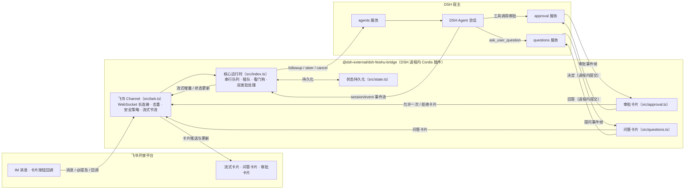

# @dsh-external/dsh-feishu-bridge

> 飞书机器人 ↔ DSH 对话桥：把 DeepSeek Harness（DSH）装进飞书，聊天即算力。


-4B32C3)


DSH（DeepSeek Harness）的进程内 Cordis 插件：飞书 IM 收发消息，流式卡片实时呈现 DSH 的思考与工具调用进度；问答卡片、工具审批卡片直接在飞书里点按完成；斜杠命令全量遥控会话——无需打开 Web GUI，也能完整使用 DSH。

## ✨ 功能特性

- 🚀 **飞书 IM ↔ DSH 对话桥**：基于 WebSocket 长连接收发消息，私聊即聊即答，群聊 @ 机器人触发。
- ⚡ **流式卡片**：DSH 输出逐字实时渲染到飞书卡片，思考过程「看得见」。
- 🔧 **工具调用进度**：agent 调用工具时卡片实时显示「🔧 正在调用工具：xxx…」，多步回合不再干等。
- 🎯 **问答卡片**：agent 的 `ask_user_question` 以交互卡片呈现——按钮单选、勾选多选、聊天自由文本作答，点按即答。
- 🛡️ **工具审批卡片**：agent 请求工具时推送「✅ 允许一次 / 🚫 拒绝」卡片，决策在飞书内完成；10 分钟未响应自动过期撤卡。
- ⌨️ **斜杠命令**：15 个命令覆盖模型切换、工作区管理、会话恢复、流式开关、免审批模式等（见下方命令表）。
- 🔀 **每会话串行队列 + 插队**：同一聊天内消息按序处理；新消息可打断运行中的慢回合（阈值可配），也可强制排队。
- 🐕 **看门狗**：单回合超过时限自动取消该回合并回复错误卡片，**绝不退出进程**。
- 📦 **消息突发批处理**：短窗口内连发的普通消息合并为一次进入 DSH，省调用、省 token。
- 💾 **状态持久化**：会话代次、工作区绑定等持久化到本地状态文件，重启后记忆保留。
- 🔁 **断线自愈**：长连接异常自动退避重连；重连后向所有已知会话广播恢复通知。
- 🧠 **会话记忆管理**：`/reset` `/new` 开启新的记忆代次，`/resume` 带摘要恢复历史会话，`/workspace` 绑定工作区。
- 📊 **用量透明**：回复卡片底部显示本会话累计 token 用量（输入 / 输出，K/M 格式化）。

## 📐 架构

本插件是运行在 DSH 进程内的 Cordis 插件（`inject: ['agents']`），通过 **ctx 服务直调**驱动 DSH：

- 消息注入走 `agents` 服务的 `create` / `resume` / `followup` / `steer` / `cancel`，全程进程内直调，不另起进程、不走网络；
- 审批卡片与问答卡片订阅宿主的进程内事件帧，经 `approval` / `questions` 服务交互，点按结果直接提交回宿主；
- 不注册任何 provider / answerer，不与宿主自带实现冲突，卸载即净。



模块一览：

| 模块 | 职责 |
| --- | --- |
| `src/index.ts` | 插件入口与核心运行时：消息入口、每 chat 串行队列与插队、看门狗、流式 / 非流式回复管线、生命周期 |
| `src/lark.ts` | 飞书 Channel：WebSocket 长连接、消息去重、聊天队列、陈旧消息窗口、流式卡片节流 |
| `src/commands.ts` | 斜杠命令表与分发 |
| `src/approval.ts` | 工具审批卡片：订阅审批事件、发卡、按钮回调路由、过期回收、YOLO 自动放行 |
| `src/questions.ts` | 问答卡片：单选 / 多选 / 自由文本、答案提交、过期回收 |
| `src/batching.ts` | 消息突发批处理：滑动窗口合并普通消息 |
| `src/state.ts` | 状态持久化：会话代次 / 会话列表 / 工作区绑定 / 会话覆盖 |
| `src/text.ts` | 文本处理：@ 提及剥离、超长截断、token 数量格式化 |

## 🚀 快速开始

### 前提

- 已部署 **DSH（DeepSeek Harness）** 环境。
- 本插件 `peerDependencies` 依赖 DSH 内部包（`@deepseek-ai/dsh-llm`、`@deepseek-ai/dsh-tools`，不发布于公开 npm）以及 `cordis`、`schemastery`，**必须运行在 DSH 进程内**，无法独立安装或独立部署。
- 在[飞书开放平台](https://open.feishu.cn/)创建**企业自建应用**，开通机器人能力（消息接收 / 发送、交互卡片等），取得 **App ID** 与 **App Secret**。

### 方式一：从 Releases 安装（推荐）

1. 在 [GitHub Releases](https://github.com/21hbguo/dsh-feishu-bridge-plugin/releases) 下载最新版本的 `.tgz` 包（如 `dsh-external-dsh-feishu-bridge-0.0.1.tgz`）。
2. 在 DSH 管理端使用注入器安装：
   - `dev_inject_plugin <包目录>` —— 运行时注入，免重启；或
   - `dev_install_package <包目录>` —— 热装配并写入装配清单，重启后依然生效。
3. 配置凭据（见下），插件装配后即可在飞书里与机器人对话。

### 方式二：源码构建

1. `git clone https://github.com/21hbguo/dsh-feishu-bridge-plugin`（或从 Releases 下载源码包）。
2. 构建需要 DSH checkout 环境：`scripts/build.sh` 会把 DSH checkout 内的 `cordis`、`schemastery`、`@deepseek-ai/dsh-llm`、`@deepseek-ai/dsh-tools` 等依赖以目录链接接入 `node_modules`，并使用 checkout 自带的 `tsc` 编译——这些内部依赖不在公开 npm 上，因此**脱离 DSH checkout 无法独立构建**。

   ```bash
   DSH_CHECKOUT=<dsh-checkout-路径> bash scripts/build.sh
   ```

3. 构建产物为 `lib/`，随后同样用注入器安装。

> 💡 绝大多数用户请直接使用方式一，无需本地构建。

### 配置

凭据通过**环境变量**或插件 **Config** 提供（Config 优先）：

```bash
export FEISHU_APP_ID="cli_xxxxxxxxxxxxxxxx"
export FEISHU_APP_SECRET="xxxxxxxxxxxxxxxx"
```

| 环境变量 | 说明 |
| --- | --- |
| `FEISHU_APP_ID` | 飞书应用 App ID（Config 未填时的回退） |
| `FEISHU_APP_SECRET` | 飞书应用 App Secret（Config 未填时的回退） |

## ⚙️ 配置项

| 字段 | 类型 | 默认值 | 说明 |
| --- | --- | --- | --- |
| `feishuAppId` | string | `''`（回退 `FEISHU_APP_ID`） | 飞书应用 ID |
| `feishuAppSecret` | string | `''`（回退 `FEISHU_APP_SECRET`） | 飞书应用密钥 |
| `stream` | boolean | `true` | 流式卡片总开关（每个会话可用 `/stream` 覆盖） |
| `maxTurnMs` | number | `600000` | 看门狗时长：单回合超过该毫秒数则取消该回合，并回复错误卡片 |
| `interruptAfterMs` | number | `0` | 插队阈值：运行中回合超过该毫秒数，新消息打断它优先处理（`0` = 立即打断） |
| `streamThrottleMs` | number | `40` | 流式卡片推送节流间隔（毫秒） |
| `streamThrottleChars` | number | `12` | 流式卡片推送触发字符数 |
| `maxReplyChars` | number | `4000` | 非流式回复截断阈值（字符） |
| `batchWindowMs` | number | `800` | 消息突发批处理窗口（毫秒）：窗口内同一聊天的连续普通消息合并为一条进入 DSH；`0` = 禁用 |

## ⌨️ 斜杠命令

| 命令 | 参数 | 说明 |
| --- | --- | --- |
| `/help` | — | 列出所有可用命令 |
| `/ping` | — | 连通性自检（回复 `pong 🏓`） |
| `/status` | — | 查看桥与当前会话状态：机器人、模型、会话 ID、工作区、流式开关、队列深度、运行时长、最近回答摘要 |
| `/reset` | — | 清空本会话记忆，开启新的 DSH 会话 |
| `/new` | — | 同 `/reset`，开启新会话 |
| `/workspace` | `[序号 \| 路径]` | 列出 / 切换工作区；`/workspace 0` 解除绑定（未分组，宿主默认 cwd）；`<路径>` 为已存在目录时自动创建并绑定；切换即开新会话（记忆清空） |
| `/model` | `[序号]` | 列出可用模型，或 `/model <序号>` 切换（下一回合生效，记忆保留） |
| `/stream` | `on \| off` | 本会话流式回复开关（无参查看当前状态） |
| `/cancel` | — | 取消当前运行中的回合（回合卡住时自救） |
| `/resume` | `[序号]` | 列出最近 10 个会话（带摘要）或 `/resume <序号>` 切换恢复记忆；支持恢复同一工作区内 web 端创建的会话，已归档自动隐藏 |
| `/restart` | — | 重连飞书长连接（不退出进程） |
| `/yolo` | `[off]` | 本会话免审批模式：权限预设切换为 `danger-full-access`，工具调用自动放行；`/yolo off` 恢复 `workspace-write`。内存态，重启自动关闭 |
| `/squeeze` | `<内容>` | 以「强制排队」模式处理内容（等待当前回合完成后处理） |
| `/steer` | `<内容>` | 以「强制插队」模式处理内容（打断当前回合优先处理） |
| `/ai` | `<内容>` | 显式把内容发给 AI（以 `/` 开头的内容会被当作命令，需要发送给 AI 时请使用它） |

> 普通消息（非 `/` 开头）直接进入对话管线；同一聊天内连续发送会先经过突发批处理窗口，再合并进入 DSH。

## 🔐 安全说明

- **凭据不落盘、不硬编码**：App ID / App Secret 仅通过环境变量或插件 Config 注入，仓库与源码中不含任何凭据；日志只记录机器人名称与消息摘要，不记录密钥。
- **无遥测、无外部上报**：插件只在 DSH 进程内与飞书开放平台通信，不向任何第三方发送数据。
- **运行时数据本地存储**：`open_id`、chat id、会话代次 / 工作区绑定等仅写入本地状态文件（`~/.dsh/dsh-feishu-bridge/state.json`），不发送到任何远端。
- **权限可控**：`/yolo` 免审批模式需用户显式开启，且为内存态——重启自动关闭，不会悄悄长驻高权限。

## ❓ 常见问题

**Q1：为什么不能独立 `npm install` / 独立部署？**

本插件的 peer 依赖包含 DSH 内部包 `@deepseek-ai/dsh-llm` 与 `@deepseek-ai/dsh-tools`，它们不发布到公开 npm；同时插件运行时依赖 DSH 进程内的 `agents` / `approval` / `questions` 等服务。因此它只能作为 DSH 进程内的 Cordis 插件运行——请使用 Releases + 注入器安装。

**Q2：状态文件在哪？删了会怎样？**

状态文件位于 `~/.dsh/dsh-feishu-bridge/state.json`，保存每个聊天的会话代次、会话列表、工作区绑定与会话覆盖。删除后插件会以全新状态启动（各聊天从新会话开始）；历史会话的记忆内容由 DSH 的会话持久化管理，不受影响。

**Q3：为什么源码构建需要 DSH checkout？**

`scripts/build.sh` 需要把 DSH checkout 中的 `cordis`、`schemastery` 与 `@deepseek-ai/*` 内部包目录链接进 `node_modules`，并使用 checkout 自带的 `tsc` 编译。这些依赖不在公开 npm 上，脱离 DSH 环境无法解析，因此构建必须在 DSH checkout 环境下进行。

**Q4：群聊里 @ 了机器人不回复？**

群聊消息必须 @ 机器人才会进入处理（私聊无需 @）；另外机器人自身发出的消息会被忽略，不会自我对话。

## 📄 License

本项目基于 [BSD-3-Clause](./LICENSE) 协议开源发布。

致谢：感谢 **DeepSeek Harness（DSH）** 提供的进程内 agent 运行时，以及[飞书开放平台](https://open.feishu.cn/)提供的 IM 与卡片能力。
