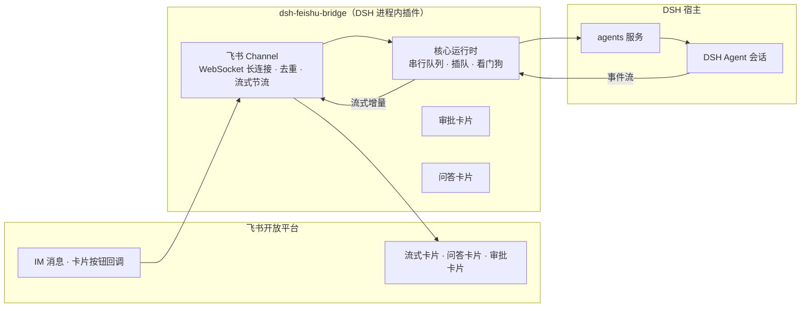

# 飞书 × DeepSeek：10 分钟把 DSH 变成飞书机器人，流式思考看得见，工具审批点一下

> 摘要：飞书 × DeepSeek：10 分钟把 DSH 装进飞书，聊天即算力。流式卡片让思考过程看得见，问答与工具审批点按即答；无需公网回调，扫码一键配置，17 条斜杠命令全量遥控会话，断线自愈、用量透明。开源新项目，欢迎试用反馈。
>
> 开源项目：[21hbguo/dsh-feishu-bridge-plugin](https://github.com/21hbguo/dsh-feishu-bridge-plugin) ⭐1（2026-08 刚开源）
> 一句话：把 DeepSeek Harness（DSH）装进飞书，聊天即算力——不用打开 Web 界面，在飞书里就能完整使用你的 AI Agent。

## 痛点：AI 能力都在终端/网页里，聊天工具接不上

很多人在本地部署了 DeepSeek Harness（DSH）这类 AI Agent 运行时，能力很强：能自己规划任务、调用工具、操作文件、跑命令。但日常使用有门槛：

- 必须打开 Web GUI 或终端，**手机上用不了**；
- Agent 思考过程是黑盒，**等结果像开盲盒**；
- 工具调用要授权时，**得切回桌面点确认**；
- 想给同事/朋友用，**得教他们部署环境**。

而飞书是很多团队每天都在用的 IM——如果 Agent 直接住在飞书里，私聊即聊即答、群聊 @ 触发、卡片上点按审批，体验会完全不一样。

这就是我开源 [dsh-feishu-bridge-plugin](https://github.com/21hbguo/dsh-feishu-bridge-plugin) 的初衷：**做一个「飞书机器人 ↔ DSH 对话桥」，把完整的 Agent 能力搬进飞书聊天**。

## 它是什么

DSH（DeepSeek Harness）的**进程内 Cordis 插件**：飞书 IM 收发消息，**流式卡片**实时呈现 DSH 的思考与工具调用进度；问答卡片、工具审批卡片直接在飞书里点按完成；17 个斜杠命令全量遥控会话。

核心能力一览：

| 能力 | 效果 |
| --- | --- |
| 🚀 飞书 IM ↔ DSH 对话桥 | WebSocket 长连接，私聊即聊即答，群聊 @ 机器人触发 |
| ⚡ 流式卡片 | DSH 输出逐字实时渲染，思考过程「看得见」 |
| 🔧 工具调用进度 | 卡片实时显示「🔧 正在调用工具：xxx…」，多步回合不再干等 |
| 🎯 问答卡片 | `ask_user_question` 以交互卡片呈现——按钮单选、勾选多选、自由文本，点按即答 |
| 🛡️ 工具审批卡片 | 「✅ 允许一次 / 🚫 拒绝」在飞书内完成，10 分钟未响应自动过期撤卡 |
| ⚡ 扫码一键配置 | 发 `/setup` 或调用 `feishu_setup` 工具，扫码自动完成「创建应用 + 获取凭据 + 重连」 |
| ⌨️ 17 个斜杠命令 | 模型切换、思考强度、工作区、会话恢复、流式开关、免审批模式全覆盖 |
| 🔁 断线自愈 | 长连接异常自动退避重连，重连后广播恢复通知 |
| 📊 用量透明 | 回复卡片底部实时显示本会话累计 token 用量 |

## 为什么值得关注：技术上的几个亮点

**1. 不需要公网回调地址。** 传统飞书机器人要配 webhook/回调 URL，个人部署很麻烦。本插件用**长连接模式**：插件主动发起 WebSocket 连接收发消息，本地部署零公网暴露。

**2. 进程内直调，不另起进程。** 插件运行在 DSH 进程内（`inject: ['agents']`），消息注入走 `agents` 服务的 `create/resume/followup/steer/cancel`，全程进程内调用、不走网络；审批与问答卡片订阅宿主的进程内事件帧，点按结果直接提交回宿主。不注册任何 provider/answerer，不与宿主自带实现冲突，卸载即净。

**3. 消息管线做了工程化处理。** 每会话串行队列 + 插队（新消息可打断慢回合，阈值可配）、看门狗（单回合超时自动取消，**绝不退出进程**）、消息突发批处理（短窗口内连发消息合并进一次调用，省 token）。

架构示意（Mermaid）：



## 10 分钟从零到用

前提：已部署 DSH（DeepSeek Harness）环境 + 一个可登录[飞书开放平台](https://open.feishu.cn/)的账号。

### 第一步：一键安装插件

Linux / macOS 一条命令（自动完成「下载 Release → 解压 → 装配进 web profile → 建软链」）：

```bash
curl -fsSL https://raw.githubusercontent.com/21hbguo/dsh-feishu-bridge-plugin/main/scripts/install.sh | bash
```

（Windows 用户在 [Releases](https://github.com/21hbguo/dsh-feishu-bridge-plugin/releases) 下载 `.tgz` 后按 README 方式 A 手动装配；有 `dsh-super-injector` 的用户用 `dev_install_package` 一行搞定。）

装完**完全重启 DSH** 即生效。

### 第二步：扫码一键配置（最省事路径）

首次配置**只能走 DSH 入口**（此时机器人还没连上飞书，飞书里的 `/setup` 发不出去）——在 DSH 会话里对 agent 说：

> 「配置飞书」或「生成飞书授权链接」

agent 会自动调用 `feishu_setup` 工具返回一个**授权链接**（有效期 3600 秒），浏览器打开后用飞书 App 扫码确认，插件自动写入凭据（`~/.dsh/dsh-feishu-bridge/credentials.json`，权限 0600）并重连飞书——**全程无需离开 DSH，不需要手动去开放平台建应用**。

想手动配置也可以：开放平台创建企业自建应用 → 启用机器人 → 开通 `im:message` 与 `im:message:send_as_bot` 两个权限 → 添加可用范围 → **创建版本并发布** → 拿到 App ID / Secret 填环境变量（`FEISHU_APP_ID` / `FEISHU_APP_SECRET`）。

### 第三步：验证

1. 飞书里搜索机器人，私聊发 `你好`；
2. 机器人应回复**流式卡片**——思考与工具调用进度逐字实时渲染，底部显示 token 用量；
3. 群聊测试记得 **@机器人** 才触发（私聊无需 @）。

然后就可以玩起来了：`/model` 切换模型、`/effort` 调思考强度、`/workspace` 绑定工作区、`/resume` 恢复历史会话、`/yolo` 开启免审批模式……完整 17 条命令见 README 命令表。

## 踩坑记录（飞书机器人开发者的血泪）

开发过程中踩的坑，基本都沉淀在 README 排错表里了，这里挑最要命的几个：

1. **机器人完全不回复，90% 是没「发布版本」。** 开放平台里只保存了配置 ≠ 生效，必须到「版本管理与发布」创建版本并发布、等审核通过。README 原话：*大量「机器人不回复」的案例都是只保存了配置、忘了发布版本*。
2. **403 / 权限不足**：开通 `im:message` / `im:message:send_as_bot` 后，**必须重新创建版本并发布**再试——权限变更不会自动生效。
3. **可用范围默认是空的**：不加成员/群组，谁都不可用。
4. **群聊必须 @ 机器人**，私聊不用。
5. **扫码配置是 createOnly 设计**：每次 `/setup` 都会创建新应用，重复执行会累积多个应用（预期行为，介意可去后台删旧的）。

## 安全说明（可以放心用）

- 凭据不硬编码：环境变量 / Config / 扫码凭据文件注入，仓库与源码不含任何凭据；
- 无遥测、无外部上报：只与飞书开放平台通信，不向任何第三方发送数据；
- 运行时数据本地存储：`open_id`、chat id、会话代次等仅写入本地状态文件；
- `/yolo` 免审批模式需显式开启，且为内存态——重启自动关闭。

## 结语

这个项目的定位很明确：**让 DSH 的 Agent 能力「长」在飞书里**。适合已经在用 DSH、又离不开飞书的团队和个人；也适合想研究「IM × Agent 交互范式」（流式卡片、卡片审批、问答卡片）的开发者——代码结构清晰（`src/` 下 index/lark/commands/approval/questions/batching/state/text 各司其职），值得一看。

项目地址：[https://github.com/21hbguo/dsh-feishu-bridge-plugin](https://github.com/21hbguo/dsh-feishu-bridge-plugin)（BSD-3-Clause）

刚开源、还在快速迭代中，欢迎试用并到 Issues 里提建议、报 bug；有想加的功能（比如消息流式语音、多机器人实例、群话题隔离）也欢迎来聊——你的第一个 PR 会很有价值。🌟
